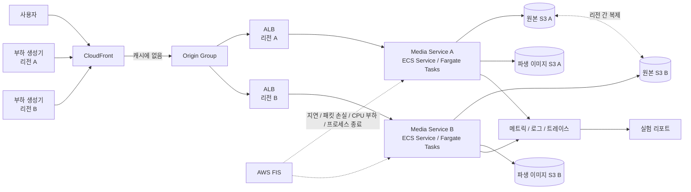

# Content Serving Lab

이미지 요청이 한꺼번에 몰리거나 한 리전에 장애가 났을 때 콘텐츠 전달 경로에서 무슨 일이 일어나는지 직접 확인해 보는 프로젝트입니다. 작은 AWS 환경에 부하와 장애를 만들어 보고, 대응 전후의 지연 시간과 오류, 비용을 비교합니다.

현재 구현된 범위는 Go media endpoint, E1 Phase A/B workload·분석과 AWS S4 측정을 위한 S3 store·Task 계측 기반입니다. Phase A에서 프로세스 내부 동일 요청 합치기를 채택했고, Phase B에서 다른 key 격리, leader cancellation과 local 2/4-process 경계를 retained 측정했습니다. 실제 ECS/S3 workload 실행과 분산 조정은 아직 구현 전입니다.

## 실험

| 실험 | 확인하려는 것 | 주요 지표 | 상태 |
| --- | --- | --- | --- |
| [E1. 캐시 폭주](experiments/e1-cache-stampede/README.md) | 같은 이미지의 첫 요청이 동시에 들어올 때 중복 변환을 얼마나 줄일 수 있는가? | [Phase A: 변환 100→1회](reports/e1-cache-stampede/README.md), [Phase B: local 2/4 process에서 변환 2/4회](reports/e1-cache-stampede/PHASE-B.md) | Phase A/B local 완료, AWS S4 계측 구현 |
| E2. 이미지 변환기 비교 | 같은 이미지 묶음에서 libvips와 ImageMagick 중 어느 쪽이 적합한가? | 처리량, 최대 메모리, 파일 크기와 품질 | 준비 중 |
| E3. 멀티 리전 장애 | 한 리전의 응답이 느려지거나 끊겼을 때 사용자에게 얼마나 오래 영향을 주는가? | 리전별 p95/p99, 오류율, 복구 시간 | 준비 중 |
| E4. 장애 격리 | 변환기나 저장소 장애가 캐시에 있는 이미지 요청까지 번지는 것을 막을 수 있는가? | 영향받은 요청 범위, 탐지·완화·복구 시간 | 준비 중 |
| E5. 전달 비용 | 이미지 포맷과 캐시 정책이 응답 속도와 비용을 어떻게 바꾸는가? | 캐시 적중률, 전송량, 요청당 비용 | 준비 중 |

실험이 끝나면 이 표에서 결과 요약, 그래프, 실행 방법과 원본 측정 자료로 바로 이동할 수 있게 할 예정입니다.

## AWS 구성안

아래 구성은 아직 구현 전입니다. 우선 ECS Fargate로 시작하고, 같은 요청을 Lambda에서도 실행해 볼 필요가 있는지는 측정 결과를 보고 결정합니다.



원본은 두 리전이 공유하는 source of truth이므로 리전 간 복제를 적용합니다. 변환해서 만든 이미지는 원본에서 다시 만들 수 있으므로 각 리전에 따로 저장하는 방식으로 시작합니다. 이 구성이 실제로 나은지는 리전 간 전송량, 중복 변환 횟수, 지연 시간과 장애 영향을 비교한 뒤 판단합니다.

AWS 자원은 Terraform으로 만들고 실험이 끝나면 제거합니다. 여기서 만드는 트래픽은 실제 사용자가 아닌 부하 생성기의 요청입니다. 개인 환경에서 확인한 결과를 대규모 서비스를 운영한 경험처럼 설명하지 않습니다.

자세한 내용은 [AWS 실험 구성안](docs/aws-experiment-topology.md)에 정리했습니다.

## 실험 기록 방식

리포트는 다음 순서로 작성합니다.

1. 어떤 운영 문제를 확인하려는가
2. 결과를 보기 전에 무엇을 예상했고 어떤 기준으로 선택할 것인가
3. 어느 환경에서 어떤 요청을 보냈는가
4. 변경 전 결과는 어땠는가
5. 무엇을 바꾸거나 어떤 장애를 만들었는가
6. 주요 수치가 어떻게 달라졌는가
7. 결과를 보고 무엇을 선택했는가
8. 이번 실험으로 확인하지 못한 것은 무엇인가
9. 다른 사람이 같은 실험을 실행하려면 어떻게 해야 하는가

[실험 리포트 작성 방법](docs/experiment-report-format.md)에는 첫 화면에서 결론을 읽을 수 있으면서도 결과를 다시 확인할 수 있도록 필요한 항목을 적었습니다.

## 구현할 요청 경로

```text
POST /v1/uploads
POST /v1/uploads/{upload_id}/complete
GET  /v1/assets/{asset_id}
GET  /i/{content_hash}/{transform_spec}.{format}
```

클라이언트는 미리 발급받은 업로드 URL로 원본을 S3에 직접 올립니다. 서비스는 업로드가 끝난 뒤 파일을 실제로 열어 포맷, 해상도와 용량을 확인하고 콘텐츠 해시로 원본을 식별합니다.

이미지 변환 요청은 같은 의미의 옵션이 항상 같은 키가 되도록 정규화합니다. CloudFront에 이미지가 없으면 Media Service가 다음 순서로 처리합니다.

```text
변환 옵션 검사 및 정규화
  → 파생 이미지 키 계산
  → 해당 리전의 파생 이미지 조회
  → 같은 키로 동시에 들어온 요청 합치기
  → 원본 읽기와 이미지 변환
  → 완성된 파생 이미지 저장
  → Cache-Control과 ETag를 포함해 응답
```

한 프로세스 안에서 요청을 합치는 것만으로 충분한지, 여러 ECS Task 사이에서도 조정이 필요한지는 같은 부하 조건에서 중복 변환 횟수와 비용을 비교해 결정합니다.

## 현재 구현

- Go HTTP 서버, 종료 신호 처리와 dependency-injected media pipeline
- `GET /health/live`, `GET /health/ready`
- `GET /i/{content_hash}/{transform_spec}.{format}`의 canonical key, WebP 변환과 atomic local publish
- AWS SDK for Go v2 기반 S3 원본 조회와 `If-None-Match: *` 파생 이미지 조건부 저장
- ECS metadata v4 기반 Task 식별·자원 sampling과 opt-in AWS S4 trial 제어 endpoint
- `none`/`process-singleflight` coordinator와 요청별 cancellation/server-side timeout 계약
- govips/libvips transformer와 deterministic failure transformer
- E1 S0/S1/S2/F1 barrier workload, raw CSV/Prometheus/log/resource output
- E1 Phase B S3 cold/warm isolation, event-driven F2 cancellation과 local S4 2/4-process workload
- Raw counter/request 교차 검증, 기반 표와 두 SVG 자동 생성
- Docker build 안의 test와 vet

## 로컬 실행

서비스 자체를 실행하려면 Go 1.26.7과 libvips 8.16.1 개발 파일이 필요합니다. 버전이 고정된 Docker build가 재현 경로입니다.

```bash
commit="$(git rev-parse HEAD)"
docker build --target service --build-arg "GIT_COMMIT=${commit}" -t content-serving-lab:local .
docker run --rm -p 8080:8080 content-serving-lab:local
curl http://localhost:8080/health/ready
```

기본 포트는 `8080`입니다. E1 workload와 결과 재생성 명령은 [E1 문서](experiments/e1-cache-stampede/README.md#로컬-재현)에 있습니다.

## 측정 원칙

- 결과에는 실행 날짜, 하드웨어나 AWS 자원, 리전, 입력 이미지, 동시 요청 수와 캐시 상태를 함께 적습니다.
- 평균뿐 아니라 p50, p95와 p99를 함께 봅니다.
- 부하 생성기로 만든 트래픽, 예상 비용과 실제 AWS 청구액을 구분합니다.
- 두 방식을 비교할 때는 입력과 CPU·메모리 제한을 같게 두고 여러 번 반복합니다.
- 성공 요청뿐 아니라 오류, 재시도, 중복 작업과 복구 시간도 측정합니다.
- 예상과 다른 결과나 효과가 없었던 변경도 남깁니다.

## 저장소 구조

```text
cmd/content-serving/     실행 프로그램
cmd/e1-runner/           E1 실행·분석 CLI
cmd/e1-phase-b/          E1 Phase B 격리·취소·local multi-process CLI
internal/                서비스, workload와 분석 코드
api/                     OpenAPI와 API 동작 테스트 (예정)
deploy/                  Docker와 Terraform (예정)
experiments/             부하·장애 시나리오, fixture와 원본 측정 자료
reports/                 실험별 결과 리포트 (예정)
docs/                    구성안과 설계 결정
operations/              대시보드, 운영 절차와 장애 실험 기록 (예정)
samples/                 사용 조건이 명확한 테스트 이미지와 예제 (예정)
```

첫 번째 범위는 요청 시점의 이미지 변환과 전달입니다. 이미지 실험과 AWS 재현이 끝난 뒤에만 FFmpeg worker와 HLS 전달을 추가합니다. Kubernetes나 멀티 CDN도 실제로 비교할 문제가 생겼을 때 검토합니다.
