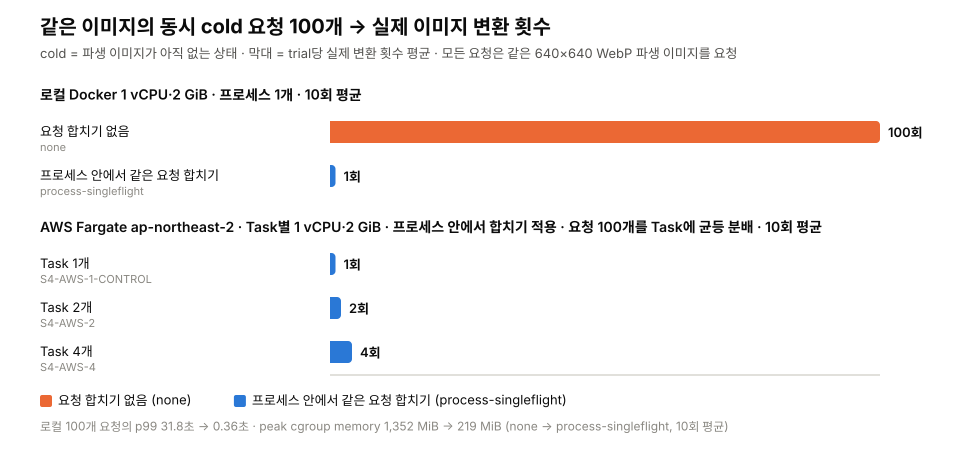
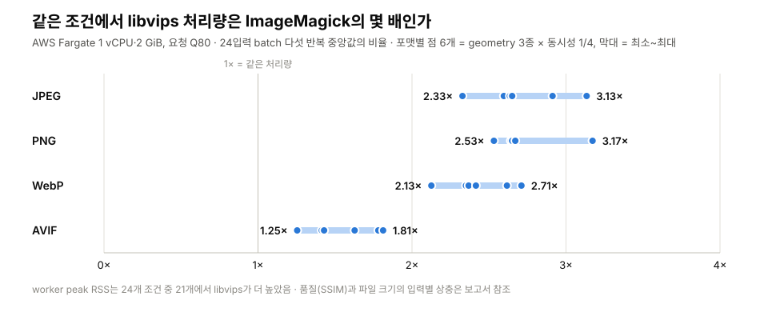
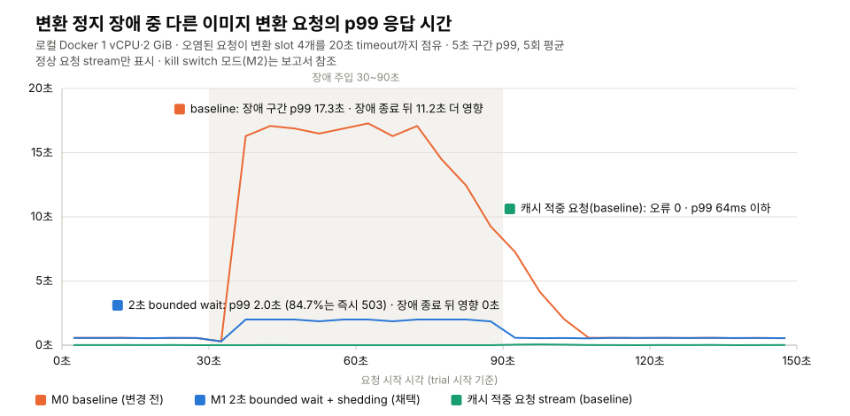

# Content Serving Lab

이미지 변환·전달 경로에 요청이 몰리거나 장애가 났을 때 무슨 일이 일어나는지 직접 재현해 측정한 프로젝트입니다. Go로 만든 작은 이미지 서비스(`GET /i/{hash}/{spec}.{format}` → 원본 읽기 → libvips 변환 → 파생 이미지 저장)에 합성 부하와 장애를 주입하고, 로컬 Docker와 실제 AWS(ECS Fargate·S3)에서 대응 전후의 변환 횟수, 지연 시간, 오류와 자원 사용을 비교했습니다. 모든 수치는 원자료와 재현 명령과 함께 이 저장소에 있습니다.

## 한눈에 보기

| 실험 | 질문 | 결과 | 결정 |
| --- | --- | --- | --- |
| [E1 캐시 폭주](#e1-캐시-폭주--같은-이미지의-동시-첫-요청을-한-번의-변환으로-합칠-수-있는가) | 같은 이미지의 첫 요청 100개가 동시에 오면 변환은 몇 번 일어나는가? | 프로세스 내 요청 합치기 구현으로 변환 100회 → 1회, p99 31.8초 → 0.36초. Task 사이는 합쳐지지 않아 AWS Task 1/2/4개에서 1/2/4회 | 프로세스 내 요청 합치기 채택. Task 간 조정은 도입하지 않음 |
| [E2 변환기 비교](#e2-변환기-비교--같은-조건에서-libvips와-imagemagick-중-무엇을-쓸-것인가) | 같은 corpus와 자원 제한에서 libvips와 ImageMagick 중 무엇을 쓸 것인가? | 같은 입력·자원 제한에서 libvips 처리량이 ImageMagick의 1.25~3.17배. 단 peak RSS는 24개 조건 중 21개에서 libvips가 높고, 품질·파일 크기는 입력별로 엇갈림 | libvips 유지 |
| [E3 장애 격리](#e3-장애-격리--변환기와-원본-저장소-장애는-다른-요청까지-영향을-주는가) | 변환기·원본 저장소 장애가 다른 요청까지 영향을 주는가? | 캐시 적중 요청은 오류 0. 정상 miss p99 17.3초 → 약 2초, 대기 상한 초과 요청은 503. 장애 종료 후 새 요청의 추가 영향은 관측되지 않음 | bounded wait 채택. kill switch는 영향이 없던 장애에서도 정상 miss 요청의 약 67%를 거부해 조건부 |

로컬 Docker(1 vCPU·2 GiB)에서 선행 실험과 측정으로 조건을 고정하고 실제 AWS 인프라(ECS Fargate 1 vCPU·2 GiB, S3, ALB, `ap-northeast-2`, 일회성 Terraform)에서 실험을 진행했습니다. AWS 비용은 조회 시점 기준 [E1 전체 사용료 약 US$0.68](reports/e1-cache-stampede/AWS-S4.md#전체-aws-실행-이력과-비용), [E2 실행일의 계정 사용료 약 US$0.53](reports/e2-transformer-ab/aws-20260910-c2/README.md#계측-범위aws-정리비용), [E3 약 US$0.09](deploy/e3-failure-isolation/COST.md#실행-후-관측)입니다. 부하는 모두 부하 생성기를 통해 만들어진 트래픽입니다.

## E1. 캐시 폭주 — 같은 이미지의 동시 첫 요청을 한 번의 변환으로 합칠 수 있는가



**왜:** 파생 이미지가 아직 없을 때 같은 요청이 한꺼번에 오면 요청 수만큼 decode·resize·encode가 중복돼 CPU와 메모리를 쓰고 다른 요청까지 느려집니다.

**어떻게:** 4,928×3,264 JPEG 한 장을 640×640 WebP로 요청하는 cold 요청 10/50/100개를 barrier로 동시에 시작해, 요청마다 변환하는 `none`과 같은 canonical key를 한 프로세스 안에서 합치는 `process-singleflight`를 각 10회 비교했습니다. 이어서 다른 키의 격리, 최초 요청 취소, 로컬 프로세스 2/4개, 실제 ECS Task 1/2/4개에서 합치기의 경계를 확인했습니다.

**결과:**

- 프로세스 안에서 같은 키의 요청을 합치자(`process-singleflight`) 동시 100개 요청의 실제 변환이 100회에서 1회로 줄었고, 그 결과 p99는 31.8초에서 0.36초, peak memory는 1,352 MiB에서 219 MiB로 내려갔습니다. 오류는 0이고 두 방식의 출력 이미지 hash는 같았습니다. 변환 한 번의 시간(약 0.33초)은 그대로이며, 기준선의 지연은 중복 변환 100건이 1 vCPU를 차례로 쓰면서 쌓인 것입니다.
- 합친 요청은 결과를 공유하므로 실패도 공유합니다. leader의 변환이 실패하면 기다리던 waiter 9개도 같은 500을 받았고, 진행 중 항목이 제거된 뒤 다음 요청이 변환을 다시 시작해 복구했습니다. 반대로 변환 작업의 수명을 최초 클라이언트의 연결과 분리했기 때문에, 최초 클라이언트가 요청을 취소해도 기다리던 9개는 결과를 받았습니다.
- 합치기는 canonical key별로 이루어지므로 다른 이미지의 변환 시작을 막지는 않았습니다. 다만 CPU는 공유하므로, 인기 이미지 요청 90개와 함께 보낸 다른 이미지의 cold p99는 단독으로 보냈을 때의 1.93배였습니다.
- 합치기 목록은 프로세스 메모리에 있어 프로세스 경계를 넘지 못합니다. 같은 이미지를 로컬 프로세스 2/4개로 나눠 요청하면 2/4회, AWS ECS Task 1/2/4개에서는 1/2/4회 변환됐습니다(30 trial, 요청 3,000개 모두 200). S3 조건부 PUT은 먼저 끝난 결과 하나만 저장해 충돌은 막았지만, 이미 수행한 변환 계산까지 없애지는 못했습니다.

**결정과 한계:** 동일 요청 합치기의 설계로 `process-singleflight`를 채택했습니다. Task 간 분산 조정(S5)은 이 결과만으로 필요성이 입증되지 않고 잠금 만료·복구 검증이 범위를 크게 넓혀 도입하지 않았습니다. 로컬 측정은 부하 생성기가 서비스와 CPU를 공유하는 합성 loopback 부하이며, 한 장의 입력과 한 가지 변환만 사용했습니다.

더 보기: [Phase A 보고서](reports/e1-cache-stampede/README.md) · [Phase B 보고서](reports/e1-cache-stampede/PHASE-B.md) · [AWS 보고서](reports/e1-cache-stampede/AWS-S4.md) · [기술 명세](experiments/e1-cache-stampede/README.md) · 원자료 [로컬](experiments/e1-cache-stampede/results/retained-20260902-68135d3ad33f/) / [Phase B](experiments/e1-cache-stampede/results-phase-b/retained-20260902-f3945ac/) / [AWS](experiments/e1-cache-stampede/results-aws-s4/retained-ad80a58dee07/) · 코드 [coordinator](internal/media/coordinator.go) / [처리 순서](internal/media/processor.go) / [부하 생성기·분석기](internal/e1runner/) / [Terraform](deploy/e1-aws-s4/README.md)

## E2. 변환기 비교 — 같은 조건에서 libvips와 ImageMagick 중 무엇을 쓸 것인가



**왜:** 변환기는 요청 시점 변환의 CPU·메모리·출력 품질을 함께 정합니다. 라이브러리 이름이 아니라 배포 후보의 실제 동작으로 고르려 했습니다.

**어떻게:** Go에서 govips/libvips 8.16.1과 imagick/ImageMagick 7.1.1 Q16을 직접 호출하는 두 worker를 같은 container image에 두고, CC0 사진과 합성 alpha·EXIF 패턴으로 만든 24개 입력을 geometry 3종 × JPEG/PNG/WebP/AVIF × 동시성 1/4로 변환했습니다. 본 측정은 Fargate Task 하나에서 다섯 반복(batch 240개, 측정 변환 5,760회)을 실행했습니다. 진단·예열·검증을 포함한 AWS 전체 호출 14,672회가 모두 성공했고, 출력 576+192개를 독립 디코딩해 geometry·orientation·alpha와 SSIM·bytes를 확인했습니다.

**결과:**

- Q80 처리량은 24개 조건 모두 libvips가 높았습니다. JPEG·PNG·WebP 2.13~3.17배, AVIF 1.25~1.81배.
- worker peak RSS는 21개 조건에서 libvips가 더 높았습니다. 메모리 절감의 보편적 승자는 아닙니다.
- 같은 요청 Q에서 ImageMagick이 더 작은 파일과 높은 SSIM을 낸 입력(alpha WebP → JPEG)이 있었고, 비슷한 SSIM을 만드는 요청 Q가 서로 달랐습니다. Q80 고정 성능을 동등 화질 성능으로 해석하지 않습니다.
- 1 vCPU에서 동시성 4의 처리량은 동시성 1의 0.65~0.87배였습니다.

**결정과 한계:** libvips를 유지합니다. alpha·JPEG처럼 ImageMagick의 bytes·SSIM 이점이 있는 입력의 비중이 커지면 그 품질점에서 다시 측정합니다. 24입력의 작은 corpus, 특정 codec·preset, 1 vCPU·2 GiB Task 하나의 다섯 반복이며 HTTP 서비스 부하나 tail latency는 측정하지 않았습니다. 선행 AWS 전체 실행은 ImageMagick의 AVIF quality 미적용을 확인해 비교 근거에서 제외했습니다. 수정·회귀 검증과 실제 quality 조회 gate를 거친 재실행 결과입니다.

더 보기: [최종 보고서](reports/e2-transformer-ab/aws-20260910-c2/README.md) · [기술 명세](experiments/e2-transformer-ab/README.md) · [실행 규격](experiments/e2-transformer-ab/RUN.md) · [corpus](experiments/e2-transformer-ab/fixtures/README.md) · [선행 실행의 결함과 수정 기록](reports/e2-transformer-ab/aws-20260910/README.md) · 코드 [libvips worker](internal/e2vips/transform.go) / [ImageMagick worker](internal/e2magick/transform.go) / [supervisor](internal/e2/) / [분석·차트](experiments/e2-transformer-ab/analyze.py) / [Terraform](deploy/e2-transformer-ab/README.md)

## E3. 장애 격리 — 변환기와 원본 저장소 장애는 다른 요청까지 영향을 주는가



**왜:** E1에서 같은 키의 요청을 합치기로 했으므로 변환 한 건의 정체를 여러 요청이 공유합니다. 그 정체가 캐시된 이미지 요청과 다른 이미지의 변환 요청에도 영향을 주는지, 영향을 준다면 코드의 격리 수단과 운영자의 kill switch가 그 범위를 얼마나 줄이는지 확인하려 했습니다.

**어떻게:** hit(저장된 이미지), 정상 miss(새 변환), 오염 miss(장애 대상) 세 stream을 open loop로 150초 동안 보내며 30~90초에 장애를 주입했습니다. 장애 4종과 대응 방식 3종을 조합해 측정했습니다.

- 장애: **T1** 느린 변환 · **T2** 변환 정지 · **T3** 즉시 오류 · **T4** 원본 읽기 지연
- 대응 방식: **M0** baseline(기존 timeout·동시 변환 상한만 적용) · **M1** bounded wait + shedding(변환 slot 대기에 2초 상한을 두고, 초과하면 503으로 거절) · **M2** kill switch(운영자가 변환 경로를 끔. miss는 즉시 503, hit은 그대로)

로컬은 방식 3 × 장애 5(장애 없음 T0 포함) × 5회 = 75 trial, AWS(S3 저장소)는 방식 3 × 장애 3(T0·T2·T4) × 2회 = 18 trial이 모두 유효했습니다.

**결과:**

- 캐시 적중 요청은 93개 trial 전부에서 오류 0, 장애 구간 p99는 로컬 10ms 이하·AWS 66ms 이하였습니다. 파생 이미지 조회가 변환 slot과 무관한 코드 구조가 실측으로 확인됐습니다.
- 영향을 받은 것은 다른 이미지의 변환 요청(정상 miss)뿐이었고, 경로는 변환 slot이었습니다. 로컬 T1/T2에서 오염된 요청이 slot 4개를 모두 점유하자 baseline 정상 miss의 93.3%가 기준 지연 1.83초를 넘었고, trial별 p99 평균은 17.3초였습니다. Slot 대기는 최대 25건, 보유 원본은 최대 118 MiB였으며 peak cgroup memory는 T0보다 약 350 MiB 높았습니다. 마지막으로 영향을 받은 요청의 시작은 장애 종료 뒤 약 11초였습니다.
- M1은 slot 대기를 2초로 제한하고 초과 요청에 503(`Retry-After: 1`)을 반환했습니다. 로컬 T2 정상 miss의 84.7%가 거부됐고 p99는 약 2초, peak cgroup memory의 T0 대비 증가는 약 54 MiB였습니다. 장애 종료 후 새로 시작한 정상 요청에는 추가 영향이 관측되지 않았습니다. 정상 시 지연 차이는 반복 간 변동 안이었습니다.
- M1이 원본 읽기를 slot 안으로 옮긴 탓에 원본 지연(T4)에서는 baseline에서 영향이 없던 장애가 정상 miss의 85% 거부로 바뀌었습니다.
- M2는 켜기 전 20초 동안 baseline과 같았고, 켠 뒤에는 영향이 없던 장애(T3, T4)에서도 정상 miss의 67%를 거부했습니다.

**결정과 한계:** 변환 slot 대기 제한 방식으로 M1을 채택했습니다. 원본 읽기를 slot 밖에 두고 보유 원본 bytes에 별도 상한을 두는 변형은 후속 검토 조건이며 아직 구현하지 않았습니다. kill switch는 정상 miss 지표가 실제로 나빠진 것을 확인한 뒤에만 켭니다. 단일 프로세스·단일 Task이고 자동 탐지, 클라이언트 재시도, 여러 Task 사이의 격리는 측정하지 않았습니다.

더 보기: [보고서](reports/e3-failure-isolation/README.md) · [기술 명세](experiments/e3-failure-isolation/README.md) · 원자료 [로컬](experiments/e3-failure-isolation/results/retained-e8c21674a86f5d4737b23a59e2071da7754f4ff2/) / [AWS](experiments/e3-failure-isolation/results-aws/aws-measure-3040e3db9be0/) · 코드 [transform gate](internal/media/gate.go) / [kill switch](internal/media/killswitch.go) / [장애 주입](internal/media/faults.go) / [제어 endpoint](internal/e3control/) / [부하 생성기·분석기](internal/e3runner/) / [Terraform](deploy/e3-failure-isolation/README.md)

## 실험 방법

- 서비스와 실험 실행기는 Go, 분석 도구는 Go와 Python으로 작성했습니다. 실험별 Dockerfile은 base image digest를 고정하며, 같은 실험의 로컬·AWS 실행은 해당 Dockerfile로 만든 image를 사용했습니다.
- 각 보고서는 [같은 순서](docs/experiment-report-format.md)로 씁니다. 질문 → 결과를 보기 전의 예상과 선택 기준 → 환경 → 변경 전 → 변경 → 수치 → 결정 → 확인하지 못한 것 → 재현 방법.
- 결과에는 commit, image digest, 자원 제한, 입력, 동시 요청 수와 캐시 상태를 함께 적습니다. E1/E3는 전체 요청을 합치는 대신 trial별 p50/p95/p99를 계산한 뒤 평균합니다. E2는 batch 처리량·RSS의 다섯 반복 중앙값과 범위를 보고합니다. 오류·중복 작업·장애 종료 후 영향과 peak memory도 함께 봅니다.
- 유효성 기준은 측정 전에 정합니다. E1에서 start skew 108ms인 trial 하나는 사전 상한 100ms를 초과해 제외하고 같은 조건의 보충 run을 실행했습니다. E3의 첫 AWS calibration은 CPU 포화, 두 번째는 공유 bucket의 이전 파생 이미지 때문에 무효 처리하고 기록만 남겼습니다.
- E1/E3 분석기는 요청별 CSV·Prometheus counter·자원 sample·log를, E2 분석기는 worker 기록·호출 수·출력 hash·독립 디코딩 결과를 교차 검증한 뒤 표와 그래프를 만듭니다. 보고서의 분석 산출물은 같은 image의 독립 재분석에서 SHA-256이 같은지 확인했습니다. 이 README의 그래프 세 장도 [원자료에서 다시 그리며](docs/figures/README.md) test가 최신 여부를 확인합니다.
- AWS 자원은 Terraform으로 만들고 실험 직후 제거한 뒤 잔여 자원을 API로 다시 검사했습니다. 사전 견적과 조회 시점 비용을 구분해 기록합니다.

## 구현 범위

```text
GET /i/{content_hash}/{transform_spec}.{format}
  → 변환 옵션 검사 및 정규화 (같은 뜻의 옵션은 같은 canonical key)
  → 파생 이미지 조회 (로컬 파일 또는 S3)
  → 같은 키로 동시에 들어온 요청 합치기 (process-singleflight)
  → 원본 읽기와 변환 slot 확보 (bounded wait · shedding · kill switch; 순서는 격리 모드에 따라 다름)
  → libvips 변환
  → 완성된 파생 이미지 저장 (atomic publish · S3 If-None-Match)
  → Cache-Control과 ETag를 포함해 응답
GET /health/live, GET /health/ready
```

- Go HTTP 서버, 종료 신호 처리, dependency-injected media pipeline과 Prometheus metrics
- govips/libvips transformer와 실험용 deterministic transformer
- `none`/`process-singleflight` coordinator, 요청별 cancellation과 server-side timeout 규칙
- AWS SDK for Go v2 기반 S3 원본 조회와 조건부 파생 이미지 저장, ECS metadata 기반 Task 식별, cgroup 자원 sampling
- E3 격리 계층: 프로세스 전체 transform gate, 운영자 kill switch, 오염 source 대상 deterministic 장애 주입과 opt-in 제어 endpoint
- 실험별 부하 생성기·분석기 CLI, one-shot Fargate Terraform과 사전점검·배포·회수·제거·잔여 검사 workflow

업로드 API(`POST /v1/uploads` 등), CDN, 여러 Task 사이의 조정과 영상 경로는 구현하지 않았습니다. 프로젝트를 시작할 때 세운 CloudFront·두 리전·AWS FIS 구성안은 [AWS 실험 구성안](docs/aws-experiment-topology.md)에 배경으로만 남겼고 실행하지 않았습니다.

## 저장소 구조

```text
cmd/content-serving/          서비스 실행 프로그램
cmd/e1-runner, e1-phase-b, e1-aws-s4/   E1 부하 생성·분석 CLI (로컬 / Phase B / AWS)
cmd/e2-run, e2-vips, e2-magick/         E2 supervisor와 engine별 worker
cmd/e3-runner/                E3 장애 격리 실행·분석 CLI
cmd/readme-figures/           README 요약 그래프 생성기
internal/media/               변환 pipeline, coordinator, gate, kill switch, 장애 주입, S3 store
internal/httpapi/             HTTP handler
internal/e1*, e2*, e3*/       실험별 workload, 계측과 분석
deploy/                       실험별 Terraform과 실행·정리 scripts
experiments/                  실험별 기술 명세, fixture와 retained 원자료
reports/                      실험별 결과 보고서와 분석 산출물
docs/                         보고서 작성 방법, AWS 구성안, README 그래프
```

## 로컬 실행

Docker와 Git LFS가 필요합니다. 아래 예시는 버전을 고정한 Docker build로 서비스를 만들고, 채택한 `process-singleflight`와 `bounded-wait`를 명시적으로 켭니다. 환경 변수를 생략한 서비스 기본값은 비교 기준인 `none`·`baseline`입니다. 호스트에서 직접 빌드할 때는 Go 1.26.7과 libvips 8.16.1 개발 파일이 필요합니다.

```bash
git lfs install
git lfs pull
commit="$(git rev-parse HEAD)"
docker build --target service --build-arg "GIT_COMMIT=${commit}" -t content-serving-lab:local .
docker run --rm -p 8080:8080 \
  -e COORDINATOR_MODE=process-singleflight \
  -e ISOLATION_MODE=bounded-wait \
  content-serving-lab:local
```

다른 터미널에서 응답을 확인합니다.

```bash
curl http://localhost:8080/health/ready
```

Docker build 안에서 `go test ./...`와 `go vet ./...`가 실행됩니다. 각 실험의 workload 실행과 결과 재생성 명령은 기술 명세와 보고서에 있습니다: [E1](experiments/e1-cache-stampede/README.md#로컬-재현) · [E2](reports/e2-transformer-ab/aws-20260910-c2/README.md#원자료에서-재생성) · [E3](experiments/e3-failure-isolation/README.md#로컬-재현).
