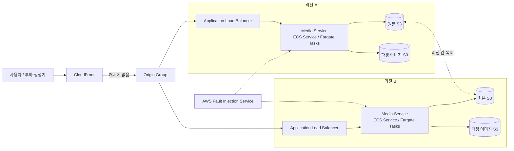
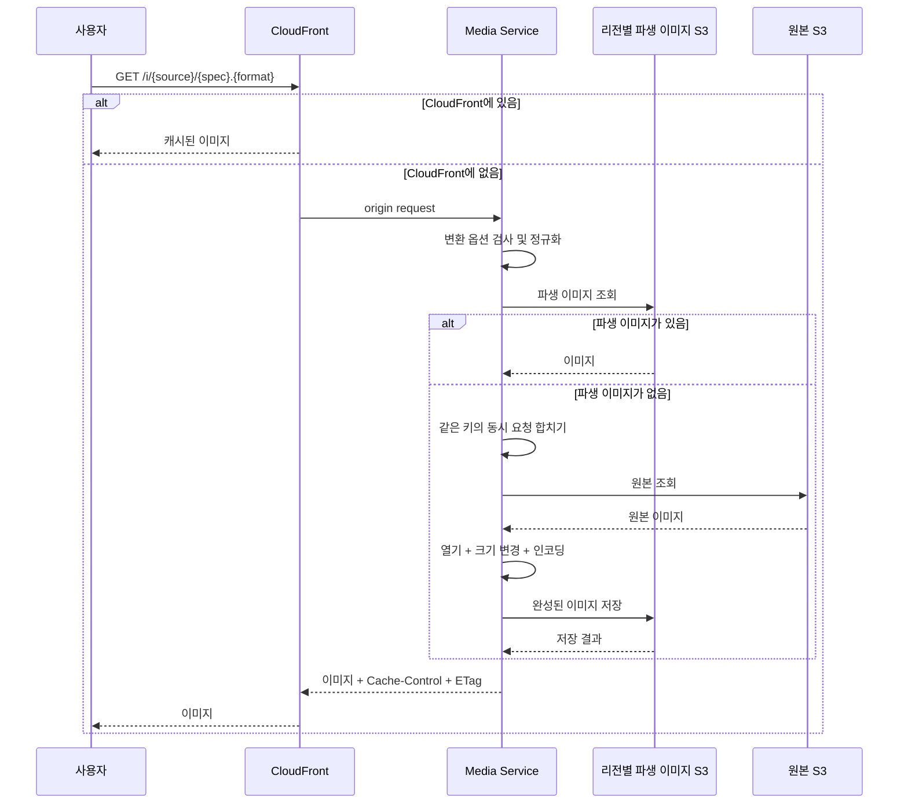

# AWS 실험 구성안

상태: **장기 구성안. 단일 리전 부분만 실행함**

프로젝트를 시작할 때 세운 AWS 구성안입니다. 이 가운데 실제로 만들고 측정한 것은 한 리전의 `ALB → ECS Fargate → S3`([E1 Terraform](../deploy/e1-aws-s4/README.md))과 ALB 없는 Fargate batch([E2 Terraform](../deploy/e2-transformer-ab/README.md))입니다. CloudFront, 두 번째 리전, 리전 간 복제, Global Accelerator, AWS FIS와 Lambda 비교는 구현하거나 측정하지 않았고 이번 프로젝트 범위에서 실행하지 않기로 했습니다. 아래 내용은 그 결정의 배경과 다시 검토할 때의 출발점으로 남깁니다.

## 첫 구성



| 역할 | 첫 선택 | 확인할 것 |
| --- | --- | --- |
| Edge cache | CloudFront | cache hit/miss에 따른 지연 시간과 origin 장애 영향 |
| 리전 진입점 | Application Load Balancer | health check, 연결 처리와 Task 교체 중 동작 |
| 이미지 처리 | ECS Service + Fargate Tasks | CPU·메모리 제한, ECS Service scale-out과 장애 주입 |
| 원본 저장 | 리전별 S3와 리전 간 복제 | 복제 지연, 다른 리전에서 읽을 때의 비용과 장애 영향 |
| 파생 이미지 저장 | 리전별 S3 | 중복 생성 비용과 장애 범위 |
| 컨테이너 이미지 | ECR | 같은 이미지를 두 리전에 배포할 수 있는가 |
| 관측 | 애플리케이션 메트릭·로그·트레이스와 CloudWatch | CloudFront 캐시 실패부터 변환과 저장까지 요청을 이어서 볼 수 있는가 |
| 장애 만들기 | 애플리케이션의 테스트 기능과 AWS FIS | 네트워크 지연, 패킷 손실, CPU 부하와 프로세스 종료 |
| 인프라 관리 | Terraform | 같은 구성을 만들고 제거하며 다시 실험할 수 있는가 |

## CloudFront에 이미지가 없을 때



Media Service는 CloudFront의 origin 역할을 합니다. 리전별 S3에 저장한 파생 이미지는 여러 ECS Task와 CloudFront edge location이 함께 사용하지만 원본에서 다시 만들 수 있습니다. 원본 S3만 source of truth로 취급합니다.

## Media Service 구성

첫 버전은 다음 기능을 하나의 Go 프로그램에 둡니다.

```text
HTTP 요청 처리
  ├─ 허용된 변환 옵션 검사
  ├─ 같은 의미의 옵션을 같은 표현으로 정규화
  ├─ 파생 이미지 키 계산
  ├─ 원본과 파생 이미지 읽기·쓰기
  ├─ 같은 키의 동시 요청 합치기
  ├─ 시간과 메모리 한도를 둔 이미지 변환
  ├─ 응답 캐시 정보 설정
  └─ 메트릭, 구조화된 로그와 트레이스
```

코드 안에서는 HTTP 처리, 이미지 변환과 저장소 접근을 나눠 작성합니다. 다만 실제로 CPU·메모리 사용 방식이나 장애 영향이 다르다는 결과가 나오기 전에는 별도 서비스로 배포하지 않습니다. 영상처럼 요청 하나에서 끝내기 어려운 작업은 이후 queue와 worker로 분리합니다.

## Runtime 선택

| Runtime | 비교할 이유 | 주의할 점 |
| --- | --- | --- |
| ECS Fargate | 이미지 라이브러리를 컨테이너에 넣기 쉽고 CPU·메모리를 지정할 수 있음. ALB와 FIS 실험에 적합 | 유휴 비용과 scale-out 지연이 있음. 실행마다 물리 호스트가 달라질 수 있음 |
| Lambda | 요청이 없을 때 실행 비용이 없고 급격한 트래픽 증가에 자동으로 scale-out | cold start, 응답 크기와 리소스 제한. 메모리 설정에 따라 CPU도 달라짐 |
| App Runner | 배포와 Auto Scaling이 간단함 | Load Balancer와 Task 교체 과정이 가려져 이번 장애 실험에는 관찰할 것이 적음 |
| ECS on EC2 | 인스턴스 종류와 호스트를 더 직접 고정할 수 있음 | AMI, 용량과 확장 관리가 별도로 필요함 |
| EKS | Pod 배치와 Kubernetes 장애를 시험할 수 있음 | 현재 실험에는 Kubernetes 자체가 추가 변수가 됨 |

ECS Fargate로 먼저 실험 도구를 완성합니다. 이후 같은 HTTP 요청과 이미지를 Lambda에서 처리해 cold start, 처리량, 오류와 비용을 비교합니다. Fargate 실행 사이의 차이가 이미지 라이브러리 비교 결과보다 크다면 고정된 EC2 인스턴스나 로컬 장비에서 한 번 더 확인합니다.

AWS에서 제공하는 Dynamic Image Transformation for Amazon CloudFront도 Lambda 구성과 ECS 구성을 별도 선택지로 제공합니다.

- [AWS Dynamic Image Transformation architecture options](https://docs.aws.amazon.com/solutions/latest/dynamic-image-transformation-for-amazon-cloudfront/architecture-options.html)
- [AWS Lambda quotas](https://docs.aws.amazon.com/lambda/latest/dg/gettingstarted-limits.html)
- [ECS Fargate task definition differences](https://docs.aws.amazon.com/AmazonECS/latest/developerguide/fargate-tasks-services.html)

## 멀티 리전 요청 전달 방식

### CloudFront Origin Group

이미지 전달의 첫 선택입니다. Primary origin의 ALB가 지정된 오류를 반환하면 CloudFront가 secondary origin으로 같은 요청을 보냅니다. 이 기능은 `GET`, `HEAD`, `OPTIONS` 요청에만 적용되므로 이미지 조회에는 쓸 수 있지만 업로드 `POST`를 보호하지는 못합니다.

- [CloudFront origin-group request and response behavior](https://docs.aws.amazon.com/AmazonCloudFront/latest/DeveloperGuide/RequestAndResponseBehaviorOriginGroups.html)

### Global Accelerator

두 리전을 동시에 사용하는 방식을 시험할 때 별도 주소로 구성합니다. 리전별 ALB 상태와 트래픽 비율을 조절해 장애가 났을 때 요청이 이동하는 시간을 측정합니다. Global Accelerator는 캐시가 아니므로 첫 실험에서는 CloudFront와 분리해 어떤 서비스가 결과에 영향을 줬는지 알 수 있게 합니다.

- [How AWS Global Accelerator works](https://docs.aws.amazon.com/global-accelerator/latest/dg/introduction-how-it-works.html)

### Route 53

DNS 가중치나 지연 시간 기반 연결도 비교할 수 있습니다. 다만 TTL과 사용자의 DNS 캐시까지 고려해야 하므로 첫 실험에서는 제외합니다.

## S3 구성 선택

### 한 리전의 S3만 사용

가장 단순한 시작점입니다. 두 번째 리전의 Media Service가 다른 리전의 S3에 의존한다는 단점이 있습니다.

### 원본은 복제하고 파생 이미지는 리전별로 생성

첫 멀티 리전 구성으로 사용할 방식입니다. 원본은 리전 사이에 복제하고 파생 이미지는 요청을 받은 리전에서 만듭니다. 원본 복제가 끝나기 전에 요청이 들어온 경우, 같은 이미지를 리전마다 다시 만드는 비용, 다른 리전 S3를 읽을 때의 지연과 장애 영향을 측정합니다.

### S3 Multi-Region Access Point

S3가 제공하는 하나의 전역 주소와 장애 전환 기능을 비교할 때 사용합니다. 요청이 전달된 버킷에 아직 파일이 복제되지 않았다면 `404`가 날 수 있으므로 이 상황을 반드시 시험합니다.

- [Managing multi-Region traffic with S3 Multi-Region Access Points](https://docs.aws.amazon.com/AmazonS3/latest/userguide/MultiRegionAccessPoints.html)
- [S3 Multi-Region Access Point request routing](https://docs.aws.amazon.com/AmazonS3/latest/userguide/MultiRegionAccessPointRequestRouting.html)

## 만들 장애와 관측할 값

| 만들 상황 | 방법 | 관측할 값 | 실행 여부 |
| --- | --- | --- | --- |
| 이미지 변환 시간 초과나 오류 | 특정 요청에만 적용되는 테스트 기능 | 캐시 적중 요청까지 영향을 받는지, 재시도 증가와 p99 | [E3](../experiments/e3-failure-isolation/README.md) 설계 초안 |
| S3 지연이나 오류 | 저장소 접근 코드의 테스트 기능 | 재시도 증가, 장애 확산과 기능 제한 방식 | [E3](../experiments/e3-failure-isolation/README.md) 설계 초안 (원본 읽기 지연) |
| CPU 또는 메모리 압박 | 제한된 부하 또는 FIS | 정상 요청의 지연, ECS Service scale-out과 새 Task가 준비되는 시간 | 실행하지 않음 |
| 네트워크 지연과 패킷 손실 | AWS FIS의 ECS Task action | origin timeout, health check 변화와 리전 전환 | 실행하지 않음 |
| 프로세스 종료 | FIS 또는 새 버전 배포 | 처리 중인 요청(in-flight request), ECS Task 교체와 복구 시간 | 실행하지 않음 |
| 리전 응답 저하 | 상태 확인과 트래픽 조절 | 탐지, 다른 리전으로 이동, 이동 직후 중복 변환 | 실행하지 않음 |

FIS를 사용한다면 실험용 AWS 계정의 태그가 붙은 자원만 대상으로 삼고, CloudWatch 경보가 정한 수치를 넘으면 실험을 중단하게 합니다. 이번 프로젝트에서는 FIS를 사용하지 않았습니다.

- [Use fault injection with ECS and Fargate workloads](https://docs.aws.amazon.com/AmazonECS/latest/developerguide/fault-injection.html)
- [AWS FIS ECS task actions](https://docs.aws.amazon.com/fis/latest/userguide/ecs-task-actions.html)

## 진행 순서와 실제 진행

처음 계획한 순서와 실제 진행은 다음과 같습니다.

| 순서 | 계획 | 실제 |
| --- | --- | --- |
| 1 | 한 리전에서 `CloudFront → ALB → ECS Fargate → S3` 구성 | CloudFront 없이 `ALB → ECS Fargate → S3`만 구성 (E1) |
| 2 | 캐시 폭주와 이미지 변환기 비교 도구 완성 | 완료 (E1, E2) |
| 3 | 같은 Terraform 구성을 두 번째 리전에 배포 | 실행하지 않음 |
| 4 | 원본 복제와 리전별 파생 이미지 저장 | 실행하지 않음 |
| 5 | CloudFront Origin Group으로 주 리전 장애 실험 | 실행하지 않음. 대신 단일 Task 안의 장애 격리를 E3로 진행 |
| 6 | FIS로 ECS Task와 네트워크 장애를 만들고 복구 과정 기록 | 실행하지 않음. E3는 애플리케이션의 테스트 기능으로 장애를 만듦 |
| 7 | Global Accelerator 비교 | 실행하지 않음 |
| 8 | ECS Fargate와 Lambda 비교 | 실행하지 않음 |
| 9 | MRAP, ECS on EC2, EKS 검토 | 실행하지 않음 |

멀티 리전 단계를 실행하지 않은 이유는 새 인프라(CloudFront, 두 번째 리전, 복제, FIS)를 만드는 시간이 남은 실험 예산을 넘고, 전환 시간의 측정 결과가 이 서비스의 코드 선택보다 AWS 서비스의 동작에 더 크게 좌우되기 때문입니다. 각 단계의 완료 기준은 변경 전후의 지연, 오류, 중복 작업, 복구 시간과 비용을 같은 조건에서 다시 측정할 수 있는 상태입니다.
