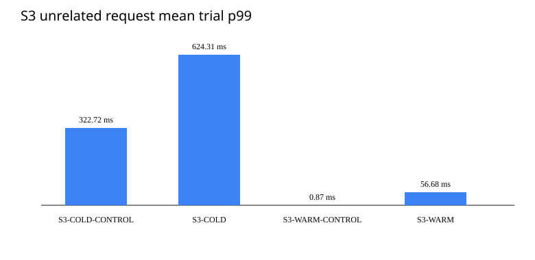
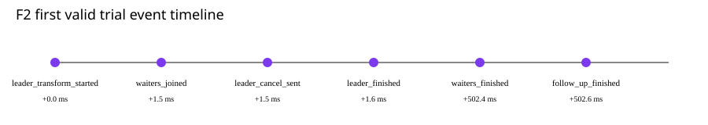
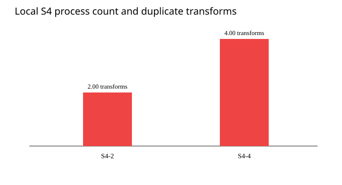

# 서로 다른 변환 요청과 여러 프로세스에서는 어디까지 합칠 수 있는가?

> 1 vCPU·2 GiB로 제한한 로컬 Docker 환경에서 서로 다른 파생 이미지 두 개는 각각 변환을 시작할 수 있었습니다. 최초 요청을 취소해도 기다리던 요청 9개는 결과를 받았지만, 프로그램을 2개와 4개로 실행하면 같은 이미지도 각각 2회와 4회 중복 변환됐습니다.



**결정:** 한 프로세스 안에서 같은 이미지 요청을 합치는 현재 방식을 유지합니다. 최초 클라이언트가 요청을 취소해도 서버의 이미지 변환과 다른 클라이언트의 대기는 계속합니다. 여러 프로세스의 변환을 하나로 합치는 기능은 아직 추가하지 않고, 실제 ECS와 S3 환경에서 중복 변환의 지연·오류·비용을 먼저 측정합니다.

## 확인할 문제

[Phase A](README.md)는 한 프로세스에 같은 파생 이미지 요청 100개가 몰릴 때 실제 변환을 100회에서 1회로 줄일 수 있음을 확인했습니다. Phase B에서는 그 방식이 적용되는 범위를 세 가지 질문으로 나눴습니다.

1. 인기 이미지가 변환되는 동안 다른 변환 요청도 별도로 시작할 수 있는가?
2. 변환을 처음 시작시킨 클라이언트가 요청을 취소해도 기다리던 다른 클라이언트는 결과를 받을 수 있는가?
3. 같은 프로그램을 여러 프로세스로 실행하면 이미지 변환은 전체에서 몇 번 일어나는가?

Phase A의 실행 명령과 결과 파일은 그대로 유지했습니다. Phase B는 별도 실행 명령 `e1-phase-b`와 결과 디렉터리 `results-phase-b/`를 사용합니다.

## 실행 환경

| 항목 | 값 |
| --- | --- |
| 실행 시각 | 2026-09-02 16:51 KST부터 |
| 측정 기준 커밋 | `f3945ac049863d9f99c01eda5332d99f2ac03c4a` |
| Docker 이미지 | `content-serving-e1-phase-b:f3945ac049863d9f99c01eda5332d99f2ac03c4a#sha256:75810ebf0feebe57368c3fd228bc4fe7abc2d28781d4c5bd5710a4f8e60f1221` |
| 실행 위치 | Docker Desktop, Linux `amd64`, 같은 컨테이너 안에서 만든 HTTP 요청 |
| 전체 자원 제한 | 1 vCPU (`100000 100000`), 2 GiB |
| 이미지 변환기 | govips `v2.16.0`, libvips `8.16.1` |
| 변환 동시 실행 제한 | 프로세스당 최대 4건, 한 변환에서 libvips worker 1개 |
| 원본 이미지 | 4,928×3,264 JPEG, SHA-256 `de206136...7f91` |
| 인기 이미지 | 640×640 cover WebP, 품질 80 |
| 비교 이미지 | 640×640 cover WebP, 품질 79 |
| 반복과 유효 기준 | 시나리오별 10회, 첫 요청과 마지막 요청의 시작 시각 차이 100ms 이하 |

S3의 인기 이미지와 비교 이미지는 같은 원본에서 출력 품질만 다르게 만들었습니다. 두 변환의 비용은 비슷하게 유지하면서 서로 다른 파생 이미지 요청으로 구분하기 위해서입니다. 각 측정은 이전 측정의 메모리 상태가 남지 않도록 별도 프로세스에서 실행했습니다.

## S3 — 인기 이미지 변환이 다른 요청의 시작을 막는가?

시나리오 ID는 다음 의미를 조합한 이름입니다.

| 표기 | 뜻 |
| --- | --- |
| `S3` | 인기 이미지 요청이 다른 이미지 요청에 미치는 영향을 확인하는 세 번째 정상 시나리오 |
| `COLD` | 비교 이미지가 아직 저장되어 있지 않아 변환이 필요한 상태 |
| `WARM` | 비교 이미지가 이미 저장되어 있어 변환 없이 읽을 수 있는 상태 |
| `CONTROL` | 인기 이미지 요청을 빼고 비교 이미지 요청만 보내는 기준선 |

따라서 `S3-COLD-CONTROL`은 비교 이미지가 없는 상태에서 비교 요청 10개만 보내는 기준선입니다. `CONTROL`이 없는 시나리오는 인기 이미지 90개와 비교 이미지 10개를 함께 보냅니다. 혼합 시나리오에서 인기 이미지는 항상 저장되어 있지 않은 상태로 시작합니다.

아래 p99는 요청 100개를 하나의 표본처럼 합산하지 않고, 유효한 반복 10회에서 각각 구한 p99를 평균한 값입니다.

| ID | 동시에 보낸 요청 | 비교 이미지 상태 | 전체 변환/회 | 최대 동시 변환 | 비교 이미지 p99 평균 |
| --- | --- | --- | ---: | ---: | ---: |
| `S3-COLD-CONTROL` | 비교 이미지 10개 | 없음 | 1 | 1 | 322.715ms |
| `S3-COLD` | 인기 이미지 90개 + 비교 이미지 10개 | 없음 | 2 | 2 | 624.305ms |
| `S3-WARM-CONTROL` | 비교 이미지 10개 | 있음 | 0 | 0 | 0.867ms |
| `S3-WARM` | 인기 이미지 90개 + 비교 이미지 10개 | 있음 | 1 | 1 | 56.679ms |

`S3-COLD`에서는 인기 이미지와 비교 이미지가 각각 한 번 변환됐고, 두 변환이 동시에 진행 중인 시점이 있었습니다. `S3-WARM`에서는 비교 이미지 요청 10개가 모두 저장된 결과를 읽었으며 추가 변환을 만들지 않았습니다. 인기 이미지 변환이 다른 변환의 시작을 막거나 서로 다른 두 요청을 같은 작업으로 잘못 합치지는 않았습니다.

다만 요청을 이미지별로 나누어 합치는 것과 CPU를 따로 사용하는 것은 다른 문제였습니다. 인기 이미지 요청을 함께 보냈을 때 비교 이미지의 cold p99는 1.93배가 됐고, 저장된 비교 이미지의 p99도 0.867ms에서 56.679ms로 늘었습니다. 요청 생성기와 서버도 하나의 CPU 제한을 공유하므로 이 수치를 실제 서비스 지연으로 일반화할 수는 없지만, 인기 이미지 변환 중 저장된 이미지 응답까지 보호하려면 자원 사용을 별도로 제한할 필요가 있음을 보여 줍니다.

## F2 — 최초 요청이 취소되면 나머지 요청도 취소되는가?

`F2`는 실패와 취소 때의 동작을 확인하는 시나리오 번호입니다. 여기서는 서버 오류가 아니라 최초 클라이언트의 요청 취소를 다룹니다.



실행 시간 차이에 따라 결과가 달라지지 않도록 정확히 500ms 뒤 성공하는 테스트용 변환기를 사용했습니다. 실행 순서는 다음과 같습니다.

1. 첫 요청이 이미지 변환을 시작합니다.
2. 같은 결과를 기다리는 요청 9개가 등록된 것을 확인합니다.
3. 첫 요청만 취소합니다.
4. 기다리던 요청과 변환이 어떻게 끝나는지 확인합니다.
5. 같은 이미지를 한 번 더 요청해 저장 결과와 내부 작업이 정상인지 확인합니다.

10회 모두 다음 결과가 같았습니다.

- 취소한 첫 요청만 취소 상태로 끝났습니다.
- 기다리던 요청 9개는 모두 같은 변환 결과를 받았습니다.
- 원본 읽기, 변환과 새 파일 저장은 각각 한 번만 일어났습니다.
- 기다리던 요청의 p99 평균은 502.908ms였습니다. 이는 실제 libvips 속도가 아니라 500ms로 고정한 테스트용 변환 시간의 결과입니다.
- 후속 요청은 새 변환 없이 저장된 결과를 평균 0.130ms에 받았습니다.
- 작업이 끝난 뒤 대기 목록과 진행 중인 변환 수는 모두 0으로 돌아왔습니다.

따라서 이미지 변환 작업의 수명은 처음 요청한 클라이언트 한 명의 연결과 분리합니다. 각 클라이언트는 자신의 요청을 취소할 수 있지만, 서버의 이미지 변환은 서버가 정한 제한 시간까지 계속됩니다. 실제 libvips 호출은 C 코드 실행이 시작된 뒤 Go의 요청 취소 신호로 즉시 중단할 수 없다는 제약도 남습니다.

## S4 — 프로그램을 여러 개 실행하면 변환은 몇 번 일어나는가?

프로세스는 실행 중인 프로그램 한 개를 뜻합니다. 프로세스마다 같은 요청을 합치는 목록을 자기 메모리에 따로 가지고 있으므로 다른 프로세스에서 이미 변환 중인 작업은 알 수 없습니다. `S4-2`와 `S4-4`의 마지막 숫자는 실행한 프로세스 수입니다.

독립된 프로세스 2개와 4개가 같은 원본과 결과 디렉터리를 사용하도록 했습니다. 실제 로드밸런서의 우연한 분배 차이를 없애기 위해 요청 100개는 각 프로세스에 같은 수로 나눠 보냈습니다.



| ID | 프로세스 수 | 요청 분배 | 실제 변환/회 | 새 파일 / 이미 존재함 | p99 평균 | CPU 사용 시간 평균 |
| --- | ---: | --- | ---: | ---: | ---: | ---: |
| `S4-2` | 2 | 50개씩 | 2 | 1 / 1 | 646.041ms | 674.17ms |
| `S4-4` | 4 | 25개씩 | 4 | 1 / 3 | 1,339.364ms | 1,380.54ms |

각 프로세스 안에서는 같은 이미지 요청이 한 번의 변환으로 합쳐졌지만 프로세스 사이는 합쳐지지 않았습니다. 그 결과 프로세스 수만큼 같은 이미지가 중복 변환됐습니다.

저장할 때는 결과 파일이 없을 때만 새로 만들도록 했습니다. 먼저 끝난 프로세스가 파일 하나를 만들었고, 나머지는 이미 파일이 있다는 결과를 받았습니다. 모든 요청은 같은 완성 이미지를 응답했으며 S4 요청 2,000개의 응답 SHA-256은 `fa5bbaa1...0c5` 한 종류였습니다. 이 방식은 파일 충돌과 불완전한 결과를 막지만 이미 수행한 이미지 변환의 계산 비용까지 없애지는 못합니다.

같은 전체 1 vCPU 제한에서 프로세스를 2개에서 4개로 늘리자 변환 횟수와 CPU 사용 시간은 약 두 배, p99는 2.07배가 됐습니다. 모든 프로세스와 요청 생성기가 하나의 CPU 제한을 공유한 로컬 결과이므로, 프로세스마다 별도 CPU를 받는 ECS에서도 지연이 같은 비율로 늘어난다는 뜻은 아닙니다.

## 여러 프로세스의 변환을 지금 하나로 합칠 것인가?

Redis나 DynamoDB 같은 외부 저장소를 사용하면 여러 프로세스 중 하나만 이미지 변환을 담당하도록 조정할 수 있습니다. 이 문서에서는 이 방식을 S5라고 부릅니다. 그러나 외부 조정을 추가하면 요청 지연, 운영 비용, 잠금 만료와 담당 프로세스 종료 시 복구라는 새로운 문제가 생깁니다.

로컬 S4는 프로세스 수만큼 중복 변환이 생긴다는 사실을 확인했지만 다음 항목은 측정하지 않았습니다.

- 로드밸런서가 실제 요청을 각 ECS Task에 어떻게 나누는지
- Task마다 별도 CPU가 있을 때 중복 변환이 응답 지연과 자원 부족에 미치는 영향
- S3에서 원본을 읽고 결과를 저장하는 시간과 요청 비용
- 외부 저장소를 사용해 프로세스 사이를 조정할 때 추가되는 지연·비용·복구 복잡성

이 로컬 결과 이후 [실제 AWS 다중 Task 측정](AWS-S4.md)을 완료했습니다. 서버 간 조정(S5)은 추가 시스템의 필요성이 충분히 입증되지 않았고 검증 범위가 크게 늘어나므로 이번 E1에서 제외합니다. 외부 조정의 지연·비용·복구 복잡성은 비교 측정하지 않았으며 경제적 우열을 주장하지 않습니다.

## 원자료 검증

7개 시나리오를 10회씩 실행한 총 70회가 모두 유효했습니다. 정상 응답 4,300개와 의도한 최초 요청 취소 10개를 기록했습니다. 한 번에 보낸 요청 중 첫 요청과 마지막 요청의 시작 시각 차이는 최대 71.416ms로, 측정 전에 정한 100ms 기준 안이었습니다.

분석 명령은 요청별 결과, 반복별 요약, 프로세스별 계측값과 F2의 취소 순서가 서로 맞는지 다시 계산했습니다. 검사 결과는 `raw_validation=passed`였으며 추가 측정은 필요하지 않았습니다.

- [실행 조건과 순서](../../experiments/e1-cache-stampede/results-phase-b/retained-20260902-f3945ac/run.json)
- [반복별 결과](../../experiments/e1-cache-stampede/results-phase-b/retained-20260902-f3945ac/trials.csv)
- [보고서 집계 표](../../experiments/e1-cache-stampede/results-phase-b/retained-20260902-f3945ac/analysis/summary.csv)
- [원자료 검사 결과](../../experiments/e1-cache-stampede/results-phase-b/retained-20260902-f3945ac/analysis/analysis.json)

## 확인하지 못한 것

- 개인 환경의 Docker Desktop에서 만든 인위적인 요청이며 실제 사용자 트래픽이 아닙니다.
- 요청 생성기와 모든 프로세스가 하나의 CPU·메모리 제한을 공유합니다.
- S3는 같은 원본의 출력 품질만 바꾼 파생 이미지 두 개를 비교했습니다. 서로 다른 원본 이미지 사이의 영향은 측정하지 않았습니다.
- 로컬 파일 저장과 요청을 같은 수로 나누는 방식은 S3 저장소나 ALB의 동작을 재현하지 않습니다.
- 이 로컬 보고서에는 실제 ECS/S3 측정이 포함되지 않습니다. 별도 [AWS 보고서](AWS-S4.md)에 다중 Task 관측값을 기록했습니다. E1 전체 Usage 비용은 해당 AWS 보고서에 기록했고 서버 간 요청 합치기는 이번 범위에서 제외해 측정하지 않았습니다.
- 서버의 변환 제한 시간 초과, 변환 중 프로세스 종료와 여러 클라이언트의 동시 재시도는 아직 확인하지 않았습니다.

## 다시 실행하는 방법

측정에 사용한 커밋을 checkout한 뒤 같은 조건과 새로운 실행 ID로 다시 실행할 수 있습니다.

```bash
git checkout f3945ac049863d9f99c01eda5332d99f2ac03c4a
commit="$(git rev-parse HEAD)"
image="content-serving-e1-phase-b:${commit}"
docker build --target experiment-phase-b --build-arg "GIT_COMMIT=${commit}" -t "${image}" .
image_id="$(docker image inspect --format '{{.Id}}' "${image}")"

mkdir -p experiments/e1-cache-stampede/results-phase-b
docker run --rm --cpus=1 --memory=2g \
  --mount "type=bind,source=${PWD}/experiments/e1-cache-stampede/results-phase-b,target=/results-phase-b" \
  "${image}" run \
  --run-id "retained-<new-run-id>" \
  --container-image "${image}#${image_id}"
```

이미 저장한 원자료만 다시 검사하고 그래프를 만들 때는 같은 Docker 이미지에서 다음 명령을 실행합니다.

```bash
docker run --rm \
  --mount "type=bind,source=${PWD}/experiments/e1-cache-stampede/results-phase-b,target=/results-phase-b" \
  "${image}" analyze --run-dir "/results-phase-b/<run-id>"
```

Phase A 재현 명령은 [E1 문서의 로컬 재현 절](../../experiments/e1-cache-stampede/README.md#로컬-재현)에 그대로 남아 있습니다.
