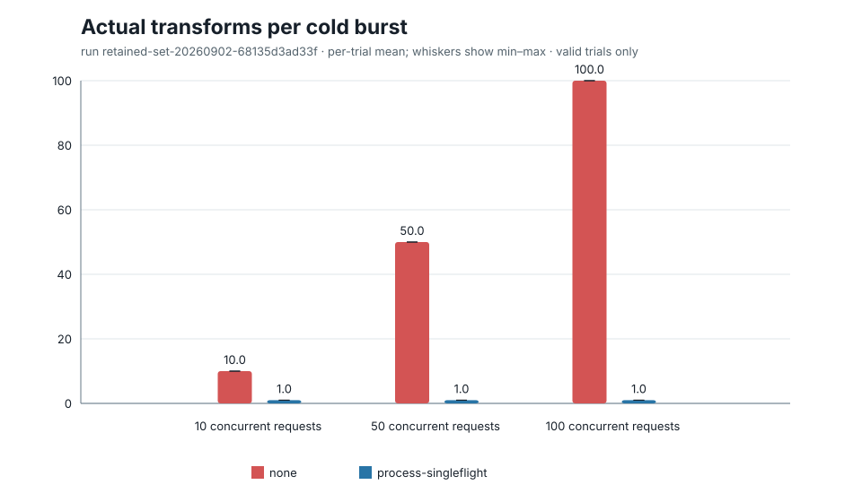
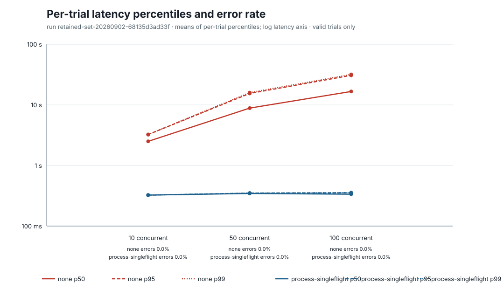

# 동시 cold miss 100개를 이미지 변환 한 번으로 합칠 수 있는가?

> 1 vCPU·2 GiB의 단일 프로세스에서 같은 파생 이미지의 동시 cold miss 100개를 합치자 실제 변환은 100회에서 1회, trial별 평균 p99는 31.78초에서 0.356초로 줄었습니다.



| 100개 cold miss 지표 | `none` | `process-singleflight` | 변화 |
| --- | ---: | ---: | ---: |
| 실제 변환 횟수 | 100회 | 1회 | -99.00% |
| p99 | 31.778초 | 0.356초 | -98.88% |
| CPU time | 31.899초 | 0.351초 | -98.90% |
| Peak cgroup memory | 1,352.0 MiB | 218.6 MiB | -83.83% |
| 오류율 | 0% | 0% | 차이 없음 |

**결정:** 같은 프로세스 안에서 동일 canonical derivative key의 cold miss를 합치는 `process-singleflight`를 다음 media path의 기본 설계로 채택합니다. 전체 transform 동시 실행 상한 4와 atomic publish는 그대로 유지합니다. 이 결정은 process-local 범위이며 여러 ECS Task 전체에서 변환이 한 번만 일어난다는 뜻은 아닙니다.

## 확인할 문제

아직 파생 이미지가 없는 상태에서 같은 이미지 요청이 동시에 들어오면 요청 수만큼 decode/resize/encode가 중복됩니다. 프로세스 내부에서 동일 key의 요청을 하나의 작업으로 합쳤을 때 변환 수, tail latency, CPU와 memory를 얼마나 줄일 수 있는지 확인했습니다.

예상은 `none`의 실제 변환 수가 요청 수에 가깝게 증가하고, `process-singleflight`는 같은 key당 한 번을 유지한다는 것이었습니다. 다음 조건을 만족하면 process-local 합치기를 선택하기로 했습니다.

- 같은 key의 실제 변환이 프로세스당 한 번입니다.
- 결과 이미지가 기준선과 같습니다.
- 오류와 timeout이 증가하지 않습니다.
- 다른 key를 하나의 global lock으로 막지 않습니다.
- Leader 실패 뒤 waiter가 끝나고 다음 요청이 복구됩니다.

## 실행 환경

| 항목 | 값 |
| --- | --- |
| 실행 시각 | 2026-09-02 10:34 KST부터 |
| Benchmark commit | `68135d3ad33fad1dffecc5b5ec8b78b26d490a27` |
| Container image | `content-serving-e1:68135d3ad33f#sha256:77e467c8f4d611813a23efb096cc439607e077bd3d4df3a9ccbf3fbe730558b4` |
| 실행 환경 | Docker Desktop, Linux `amd64`, synthetic loopback HTTP |
| Resource limit | 1 vCPU (`100000 100000`), 2 GiB |
| Transformer | govips `v2.16.0`, libvips `8.16.1` |
| Transformer limit | 동시에 최대 4건, libvips concurrency 1, operation cache disabled |
| Fixture | 4,928×3,264 JPEG, SHA-256 `de206136...7f91` |
| Derivative | 640×640 cover WebP, quality 80 |
| Timeout | Request 90초, shared transform 60초 |
| Burst validity | Generator-side start skew 100ms 이하 |
| Resource sampling | cgroup CPU/memory와 child RSS, 10ms 간격 |

각 scenario/repetition은 별도 자식 프로세스에서 다른 key로 libvips를 예열한 뒤 빈 derivative directory로 시작했습니다. Generator와 server는 같은 container와 CPU quota를 사용했습니다.

## 결과

아래 값은 요청 표본을 합쳐 계산하지 않고, scenario별 유효 trial 10개의 trial percentile/resource summary를 평균한 값입니다.

| Scenario | 유효 trial | 변환 | p50 | p95 | p99 | CPU time | Peak memory | 오류율 |
| --- | ---: | ---: | ---: | ---: | ---: | ---: | ---: | ---: |
| S0 | 10 | 1 | 328.3ms | 328.3ms | 328.3ms | 327.1ms | 209.0 MiB | 0% |
| S1-10 `none` | 10 | 10 | 2,504.1ms | 3,244.1ms | 3,244.1ms | 3,274.1ms | 697.4 MiB | 0% |
| S2-10 `process-singleflight` | 10 | 1 | 324.5ms | 324.6ms | 324.6ms | 326.8ms | 212.2 MiB | 0% |
| S1-50 `none` | 10 | 50 | 8,850.9ms | 15,421.8ms | 15,941.4ms | 16,020.3ms | 1,106.2 MiB | 0% |
| S2-50 `process-singleflight` | 10 | 1 | 345.7ms | 350.0ms | 350.2ms | 338.6ms | 217.0 MiB | 0% |
| S1-100 `none` | 10 | 100 | 16,646.7ms | 30,736.5ms | 31,778.2ms | 31,899.3ms | 1,352.0 MiB | 0% |
| S2-100 `process-singleflight` | 10 | 1 | 335.7ms | 354.9ms | 355.8ms | 351.5ms | 218.6 MiB | 0% |



| 동시 요청 | 변환 감소 | p99 감소 | CPU 감소 | Peak memory 감소 |
| ---: | ---: | ---: | ---: | ---: |
| 10 | 90.00% | 89.99% | 90.02% | 69.57% |
| 50 | 98.00% | 97.80% | 97.89% | 80.38% |
| 100 | 99.00% | 98.88% | 98.90% | 83.83% |

선택된 정상 시나리오 요청 3,210개는 모두 성공했고 응답 SHA-256은 `fa5bbaa12602c6803fc911cd560f3cd567585f7b4703499b433ac2343ab380c5` 한 종류였습니다. 따라서 두 mode의 output image가 같았습니다.

Singleflight가 이미지 한 장의 변환 자체를 빠르게 만든 것은 아닙니다. S0와 S2의 약 0.33–0.36초가 실제 한 번의 변환 시간이고, 기준선의 tail latency는 중복 변환이 1 vCPU에서 차례로 CPU를 사용하면서 증가했습니다.

## Leader 실패와 복구

F1은 200ms 뒤 실패하도록 정한 deterministic transformer에 동시 요청 10개를 보냈습니다.

- 실제 첫 transform은 1회였고 waiter 9개가 합쳐졌습니다.
- Leader와 waiter 10개 모두 약 203ms 안에 HTTP 500으로 끝났습니다.
- In-flight entry가 제거된 뒤 recovery 요청이 두 번째 transform을 시작했습니다.
- Recovery 요청은 성공해 결과를 publish했습니다.
- 전체 transform attempt는 실패 1회와 복구 성공 1회, 합계 2회였습니다.

이는 실패를 공유한 waiter가 무한 대기하지 않고 다음 요청이 다시 진행할 수 있음을 보여 줍니다. 동시에 여러 client가 자동 재시도할 때 생길 수 있는 두 번째 폭주는 이번 workload에서 만들지 않았습니다.

## Invalid trial과 보충 규칙

첫 retained run은 raw 검증을 통과했지만 `S1-100-r09`의 generator-side start skew가 108.132ms여서 사전에 고정한 100ms 기준을 넘었습니다. 요청 100개와 transform 100회는 모두 성공했지만 해당 trial은 성능 집계에서 제외했습니다. 기준을 결과에 맞춰 늘리지 않고 같은 commit/image/조건으로 보충 run을 한 번 실행했습니다.

최종 집계는 다음 deterministic rule을 사용합니다.

1. Source run 순서대로 각 성공 scenario의 첫 유효 trial 10개를 선택합니다.
2. F1은 첫 유효 trial 한 개를 선택합니다.
3. Invalid trial은 원자료와 manifest에 보존합니다.
4. 보충 run의 나머지 유효 trial 7개는 surplus로 표시하고 사용하지 않습니다.

[집계 manifest](../../experiments/e1-cache-stampede/results/retained-20260902-68135d3ad33f/analysis-retained/analysis.json)에 선택, invalid와 surplus trial ID가 모두 기록돼 있습니다.

## 결정과 되돌릴 조건

Process-local 동일 요청 합치기는 이 입력과 resource 조건에서 중복 compute, tail latency와 memory를 함께 줄였고 정상 요청 오류를 늘리지 않았습니다. Canonical key별 map을 사용하므로 different-key 작업이 같은 coordinator lock 아래에서 실행되지 않는 것도 자동 test로 확인했습니다.

Phase A 완료 뒤에는 `COORDINATOR_MODE=process-singleflight`를 기본 후보로 사용합니다. 문제가 생기면 mode를 `none`으로 바꿔 즉시 비활성화할 수 있습니다. 다음 조건에서는 결정을 다시 검토합니다.

- Leader failure coupling이나 client retry burst가 허용하기 어려운 오류 증폭을 만듭니다.
- 다른 image key나 이미 cache된 derivative 응답이 transform saturation에 막힙니다.
- ECS Task 수에 따른 중복 변환 비용이 process-local 합치기만으로 감당되지 않습니다.
- 실제 workload에서 변환 비용이 coordination/관측 복잡성보다 작습니다.

여러 프로세스 사이의 lock은 아직 선택하지 않습니다. 후속 [Phase B local 결과](PHASE-B.md)에서 process 2/4개가 각각 2/4회 변환하는 것을 확인했지만, S5 전에 실제 ECS Task와 S3 conditional write 조건을 측정하기로 했습니다.

## 한계

- 개인 환경의 Docker Desktop 안에서 만든 합성 loopback 부하이며 production traffic이 아닙니다.
- Generator와 server가 1 vCPU를 공유해 100-way start skew와 CPU time에 generator 비용이 포함됩니다.
- 한 장의 JPEG와 한 가지 640×640 WebP transform만 사용했습니다.
- Local filesystem atomic publish를 사용했으며 S3 latency, conditional write와 network 비용은 포함하지 않았습니다.
- 단일 프로세스 결과이므로 여러 ECS Task 전체의 transform이 한 번이라는 결론을 내릴 수 없습니다.
- S3 unrelated-key isolation과 F2 client cancellation은 [Phase B](PHASE-B.md)에서 측정했습니다. Retry storm, native transform timeout과 process 종료 복구는 아직 측정하지 않았습니다.
- S0는 `none`만 실행했으므로 concurrency 1에서 두 coordinator mode의 overhead를 직접 A/B한 결과는 아닙니다.

## 원자료와 다시 실행하는 방법

- [주 retained run](../../experiments/e1-cache-stampede/results/retained-20260902-68135d3ad33f/run.json)
- [보충 retained run](../../experiments/e1-cache-stampede/results/retained-supplement-20260902-68135d3ad33f-01/run.json)
- [집계 기반 표](../../experiments/e1-cache-stampede/results/retained-20260902-68135d3ad33f/analysis-retained/summary.csv)
- [집계 manifest](../../experiments/e1-cache-stampede/results/retained-20260902-68135d3ad33f/analysis-retained/analysis.json)

각 `run.json`의 command로 workload를 다시 실행할 수 있습니다. 두 raw run에서 최종 표와 chart를 다시 만들려면 현재 source로 experiment image를 build한 뒤 실행합니다.

```bash
docker build --target experiment -t content-serving-e1:report .

docker run --rm \
  --mount "type=bind,source=${PWD}/experiments/e1-cache-stampede/results,target=/results" \
  content-serving-e1:report analyze-set \
  --run-dir /results/retained-20260902-68135d3ad33f \
  --run-dir /results/retained-supplement-20260902-68135d3ad33f-01 \
  --output-dir /results/retained-20260902-68135d3ad33f/analysis-retained \
  --analysis-id retained-set-20260902-68135d3ad33f \
  --valid-trials 10
```

Analyzer는 각 source run의 `trials.csv`, `requests.csv`와 `metrics.prom`을 먼저 교차 검증한 뒤 trial 경계를 보존해 집계합니다.
