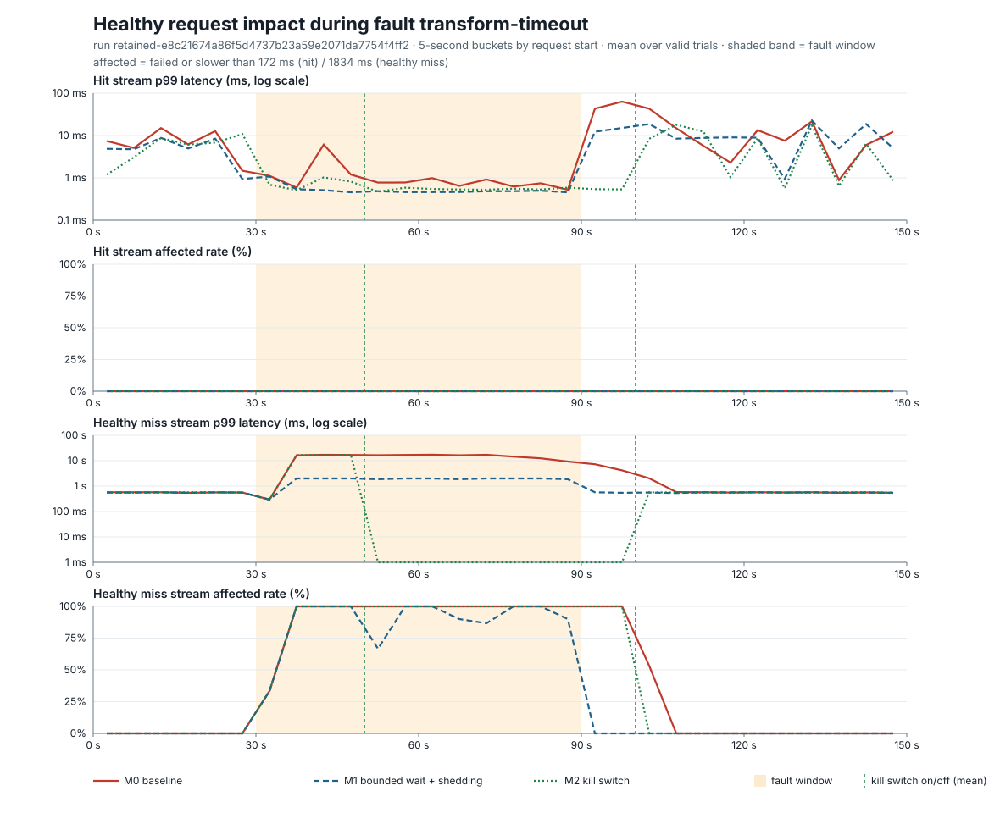

# E3 — 변환 경로 장애는 캐시 적중 요청에 번지지 않았고, 다른 변환 요청에는 17초 대기로 번졌다

> 1 vCPU/2 GiB 한 프로세스에서 오염된 변환 요청이 slot 4개를 20초씩 점유하자 baseline은 관련 없는 변환 요청의 93%를 17초 넘게 기다리게 했다. 2초 bounded wait는 그 요청들을 2초 안에 503으로 끝내고 장애 종료 즉시 정상으로 돌아왔으며, kill switch는 켜기 전 20초 동안 baseline과 같았고 번지지 않는 장애에서도 정상 요청을 거부했다. 이미 저장된 파생 이미지 요청은 어떤 조건에서도 오류 0건, p99 70ms 이하였다.



장애 구간(30~90초)의 정상 요청 결과. 로컬 retained 실행, 조합별 5회 평균.

| 지표 (T2 변환 정지, 장애 구간, 정상 miss 요청) | M0 baseline | M1 bounded wait | M2 kill switch |
| --- | ---: | ---: | ---: |
| 영향(실패 또는 1.83초 초과) 비율 | 93.3% | 87.3% | 93.3% |
| 오류 비율 (503) | 0% | 84.7% | 66.7% |
| p50 / p99 (ms) | 16,287 / 17,291 | 2,001 / 2,001 | 0.3 / 17,285 |
| 첫 영향 → 완화 (장애 시작 기준) | 4.0초 → 없음 | 4.0초 → 4.0초 | 4.0초 → 20.0초 |
| 장애 종료 뒤 마지막 영향 | 11.2초 | 0초 | 8.0초 |
| slot 대기 최대 / 보유 원본 bytes 최대 | 25건 / 118 MiB | 4건 / 16 MiB | 24건 / 114 MiB |
| peak cgroup memory (T0 대비) | 1,218 MiB (+350) | 912 MiB (+54) | 1,006 MiB (+151) |
| hit 요청 오류 / p99 | 0 / 1.2ms | 0 / 0.5ms | 0 / 0.6ms |

**결정:** 변환 slot 대기에 bounded wait와 shedding(M1)을 기본으로 채택한다. 단, M1이 원본 읽기까지 slot 안으로 옮긴 결과 원본 저장소 지연(T4)에서는 baseline이 번지지 않던 장애를 85% 거부로 바꿨으므로, 원본 읽기는 slot 밖에 두고 보유 원본 bytes에 별도 상한을 두는 변형을 다음 검토 조건으로 둔다. Kill switch(M2)는 운영자의 최후 수단으로 유지하되, 번지지 않는 장애(T3, T4)에서도 정상 miss의 67%를 거부했으므로 "장애가 실제로 번지는지"를 확인한 뒤에만 켜는 절차와 함께 쓴다.

## 확인할 문제

이미지 변환기가 느려지거나 오류를 내거나 원본 저장소가 실패할 때, 이미 저장된 파생 이미지 요청과 다른 키의 변환 요청은 얼마나 영향을 받는가. 그리고 코드에 넣은 격리 수단(bounded wait + shedding)과 운영자의 kill switch는 그 영향을 얼마나 줄이며 정상 시에 어떤 비용을 더하는가. [기술 계약](../../experiments/e3-failure-isolation/README.md)이 조건의 source of truth다.

## 왜 중요한가

E1에서 같은 키의 동시 요청을 한 프로세스 안에서 합치기로 했다. 그 결과 변환 한 건의 실패나 정체는 여러 요청이 공유한다. 이 실험은 그 공유가 어디까지 번지는지, 즉 한 이미지의 변환이 멈췄을 때 다른 이미지의 요청과 이미 캐시된 이미지의 요청까지 함께 느려지거나 실패하는지를 확인한다. 번지는 범위가 곧 사용자 영향의 범위이고, 격리 수단은 그 범위를 줄이는 대신 오류를 더 일찍 내는 상충을 가진다.

## 예상과 선택 기준

결과를 보기 전 예상은 다음과 같았다.

- hit 요청은 파생 이미지 조회 뒤 바로 응답하므로 코드 구조상 격리되어 있고, 번짐은 변환 slot(동시 4건)을 통해 정상 miss 요청에 나타난다.
- 대기 요청이 원본 bytes를 들고 있으므로 memory가 먼저 문제가 될 수 있다.
- 즉시 오류(T3)는 번지지 않는다.

선택 기준: 정상 miss 요청이 M0에서 request timeout에 도달하면 M1을 기본으로 채택한다. 도달하지 않고 지연만 늘어나면 대기 상한을 다시 논의한다. M2는 효과와 무관하게 유지하되 켜고 끄는 시간과 영향 범위를 기록한다.

## 실행 환경

| 항목 | 로컬 retained | AWS |
| --- | --- | --- |
| 실행 | `retained-e8c21674a86f5d4737b23a59e2071da7754f4ff2`, 2026-09-11 12:53~16:23 UTC | `aws-measure-3040e3db9be0`, 2026-09-11 13:12~13:58 UTC |
| 코드 / image | 공개 `e8c2167`, `content-serving-e3:e8c2167…` (image id `sha256:bafd246f…`) | 공개 `3040e3d`, ECR digest `sha256:49937a3f…` |
| 자원 | Docker `--cpus=1 --memory=2g`, Windows 11 host | Fargate 1.4.0, 1 vCPU·2 GiB, ap-northeast-2, Task 1개 |
| 저장소 | 파일 원본, 로컬 파생 디렉터리 | 같은 S3 버킷의 `originals/`·`derivatives/` |
| 조합 | 모드 3 × 장애 5 × 5회 = 75 trial, 모두 유효 | 모드 3 × 장애 3(T0·T2·T4) × 2회 = 18 trial, 모두 유효 |
| stream rate (hit / 정상 miss / 오염 miss) | 20 / 0.5 / 1 req/s | 5 / 0.2 / 0.4 req/s |
| timeline | 정상 30초 → 장애 60초 → 복구 60초 | 같음 |
| timeout / 대기 상한 / kill switch | request 30초, transform 20초, slot 대기 상한 2초, kill switch 장애 시작 +20초 on·종료 +10초 off | 같음 |
| 장애 지연 | T1·T4 15초, T2는 timeout까지 정지, T3 즉시 오류 | 같음 |

hit stream은 미리 저장한 4개 키를 반복하고, 정상 miss와 오염 miss는 매 요청 새 spec으로 실제 libvips 변환을 일으킨다. 오염 요청은 fixture의 별칭 hash를 쓰며 장애는 그 hash에만 주입된다. 부하 생성기는 open loop이고 재시도하지 않는다. AWS는 Fargate vCPU가 로컬 코어보다 느려 같은 rate에서 T0부터 CPU가 포화됐기 때문에 rate를 낮췄다. 두 환경의 절대값은 비교하지 않고 모드 간 양상만 비교한다.

## 변경 전 결과 (M0 baseline)

- T0(장애 없음): 세 stream 모두 오류 0. hit p50 0.36ms, p99 19ms. 정상 miss p50 571ms, p99 583ms. CPU 시간 69.7초/150초, peak cgroup memory 868 MiB.
- T1(15초 지연)과 T2(20초 정지): 오염 요청이 1 req/s로 slot 4개를 채우는 데 4초가 걸렸고, 그 뒤 정상 miss 요청의 93.3%가 slot을 기다리다 17.3초에 응답했다. 오류는 0건인데, transform timeout 20초가 slot 대기와 변환을 함께 묶어 대기가 끝나면 0.5초 변환이 성공했기 때문이다. 대기 요청 최대 25건이 원본 118 MiB를 들고 있었고 peak memory는 1,218 MiB로 T0보다 350 MiB 늘었다. 장애 종료 뒤에도 11.2초 동안 영향이 이어졌고 복구 구간 요청의 22%가 기준 지연을 넘었다.
- T3(즉시 오류): 정상 miss에 영향 0. 오염 요청이 CPU를 쓰지 않아 정상 miss p99가 오히려 301ms로 낮아졌다.
- T4(원본 읽기 15초 지연): 정상 miss에 영향 0. 원본 읽기가 slot 밖에서 일어나므로 오염 요청은 slot을 점유하지 않았다(대기 0건, 보유 원본 최대 8 MiB).
- hit 요청: 모든 장애에서 오류 0, 장애 구간 p99 0.9~10ms. 장애 구간의 hit p99가 정상 구간(12~19ms)보다 낮은 것은 정지·지연 장애가 CPU를 쓰지 않아 경합이 줄기 때문이다.

## 무엇을 바꿨나

- **M1 bounded wait + shedding**: slot 대기에 2초 상한을 두고 넘으면 `503`과 `Retry-After: 1`로 즉시 응답한다. 원본 읽기를 slot 확보 뒤로 옮겨 대기 중 원본 bytes를 들고 있지 않게 했다.
- **M2 kill switch**: 운영자 제어 endpoint로 변환 경로를 끈다. miss는 즉시 `503`, hit은 그대로다. 장애 시작 20초 뒤 켜고 장애 종료 10초 뒤 껐다. 탐지는 고정 시각이며 자동화하지 않았다.
- M3 circuit breaker는 구현하지 않았다.

## 주요 수치

### 장애 구간의 정상 miss 요청 (로컬, 5회 평균)

| 장애 | 지표 | M0 | M1 | M2 |
| --- | --- | ---: | ---: | ---: |
| T1 느린 변환 | 영향 비율 / 오류 비율 | 93.3% / 0% | 88.0% / 84.0% | 93.3% / 66.7% |
| | p99 (ms) | 17,290 | 2,001 | 17,288 |
| T2 변환 정지 | 영향 비율 / 오류 비율 | 93.3% / 0% | 87.3% / 84.7% | 93.3% / 66.7% |
| | p99 (ms) | 17,291 | 2,001 | 17,285 |
| T3 즉시 오류 | 영향 비율 / 오류 비율 | 0% / 0% | 0% / 0% | 66.7% / 66.7% |
| | p99 (ms) | 301 | 300 | 295 |
| T4 원본 지연 | 영향 비율 / 오류 비율 | 0% / 0% | 90.0% / 85.3% | 66.0% / 66.0% |
| | p99 (ms) | 587 | 2,035 | 553 |

영향 비율은 실패하거나 기준 지연(정상 구간 p99 최댓값의 3배, 정상 miss 1,834ms·hit 172ms)을 넘은 요청의 비율이다. M1의 영향 비율이 오류 비율보다 조금 높은 것은 2초 대기 뒤 slot을 얻어 성공한 요청이 기준 지연을 넘기 때문이다. M2의 66.7%는 kill switch가 켜진 40초 동안 거부된 요청이고, 나머지 26.7%는 켜기 전 20초 동안 M0처럼 기다린 요청이다.

### 시간 간격 (장애 시작 기준, 로컬)

| 장애 | 모드 | 첫 영향 | 완화 | 장애 종료 뒤 마지막 영향 |
| --- | --- | ---: | ---: | ---: |
| T1/T2 | M0 | 4.0초 | 없음 | 10.8~11.2초 |
| T1/T2 | M1 | 4.0초 | 4.0초 (첫 거부) | 0초 |
| T1/T2 | M2 | 4.0초 | 20.0초 (kill switch on) | 8.0초 (off까지) |
| T4 | M1 | 4.0초 | 4.0초 | 0초 |
| T3/T4 | M2 | 20.0초 | 20.0초 | 8.0초 |

첫 영향 4초는 오염 요청 1 req/s가 slot 4개를 채우는 시간이다. M0의 복구 지연은 장애 종료 시점에 slot을 잡고 있던 정지 요청과 대기열이 20초 timeout으로 빠져나가는 시간이다.

### 정상 시 비용 (T0, 전체 구간)

| 모드 | hit p50 / p99 | 정상 miss p50 / p99 | 오류·거부 |
| --- | ---: | ---: | ---: |
| M0 | 0.36 / 18.7ms | 571 / 583ms | 0 |
| M1 | 0.35 / 15.7ms | 563 / 579ms | 0 |
| M2 | 0.35 / 24.9ms | 551 / 565ms | 0 |

세 모드의 차이는 반복 간 변동(hit p99 최소 1ms·최대 45ms) 안에 있다. M1의 2초 상한은 정상 시 거부를 만들지 않았다.

### 자원 (로컬)

| 장애 | 모드 | slot 대기 최대 | 보유 원본 최대 | peak cgroup memory |
| --- | --- | ---: | ---: | ---: |
| T0 | M0/M1/M2 | 0 | 0 | 856~868 MiB |
| T1/T2 | M0 | 25 | 118 MiB | 1,216~1,218 MiB |
| T1/T2 | M1 | 4 | 16 MiB | 912~947 MiB |
| T1/T2 | M2 | 18~24 | 90~114 MiB | 956~1,006 MiB |
| T4 | M0 / M1 / M2 | 0 / 4 / 0 | 8 / 8 / 4 MiB | 953 / 928 / 902 MiB |

M0의 memory 증가분은 대기 요청이 들고 있던 원본 bytes와 일치한다. 2 GiB 한도에는 닿지 않았지만 대기 요청 수에 비례해 늘어나는 구조다.

### AWS (S3 저장소, Fargate, 2회 평균)

| 지표 (장애 구간, 정상 miss) | T2 M0 | T2 M1 | T2 M2 | T4 M0 | T4 M1 | T4 M2 |
| --- | ---: | ---: | ---: | ---: | ---: | ---: |
| 영향 비율 / 오류 비율 | 83.3% / 0% | 62.5% / 62.5% | 83.3% / 66.7% | 0% / 0% | 41.7% / 41.7% | 66.7% / 66.7% |
| p99 (ms) | 13,351 | 2,039 | 13,331 | 2,344 | 2,042 | 928 |

AWS의 T0 정상 miss는 p50 2,248ms, p99 2,334ms로 로컬의 4배다. S3 원본 GetObject(4.9 MB), Fargate vCPU의 변환, S3 PutObject가 더해진 값이다. hit은 S3 GetObject를 거쳐 p50 25ms, p99 40~66ms이며 모든 조합에서 오류 0이다. 오염 요청이 0.4 req/s라 첫 영향은 10초였고, 정상 miss 표본이 trial당 12건이라 비율의 단위가 8.3%다. 모드 간 양상은 로컬과 같다.

## 결과를 보고 무엇을 선택했나

1. **hit 경로는 격리되어 있다.** 75개 로컬 trial과 18개 AWS trial 전부에서 hit 오류 0, 장애 구간 p99는 로컬 10ms 이하·AWS 66ms 이하였다. 별도 수단 없이도 파생 이미지 조회가 변환 slot과 무관하다는 코드 구조가 실측으로 확인됐다.
2. **번짐은 변환 slot을 통해 정상 miss에만 나타났다.** 대기 요청은 원본 bytes를 들고 있어 memory 증가로 이어졌고, 장애 종료 뒤 11초까지 영향이 남았다.
3. **M1을 채택한다.** 정상 시 비용 없이 장애 구간의 정상 miss를 2초 안에 끝내고 복구 지연을 0으로 만들었다. 오류율 85%는 "17초 대기 뒤 성공"을 "2초 뒤 503"으로 바꾼 결과이며, 클라이언트가 `Retry-After`를 따를 수 있을 때 유리하다. 사전 기준(request timeout 도달)은 충족되지 않았지만, 17초 대기는 이 서비스의 30초 client timeout에서 사실상 실패와 같다고 판단했다.
4. **M1의 원본 읽기 순서는 되돌린다.** T4에서 M0는 영향 0이었으나 M1은 85%를 거부했다. 원본 읽기를 slot 안으로 옮긴 선택이 저장소 지연을 변환 slot 점유로 바꿨기 때문이다. 다음 판에서는 원본 읽기를 slot 밖에 두고 보유 원본 bytes 합계에 상한을 두는 방식을 검토한다.
5. **M2는 유지하되 조건부다.** 켜기 전 20초는 M0와 같았고, 켜진 뒤에는 장애 종류와 무관하게 정상 miss를 거부했다. T3·T4처럼 번지지 않는 장애에서 켜면 손해다. 운영자는 정상 miss의 대기·거부 지표가 실제로 나빠졌는지 확인한 뒤 켜야 한다.

되돌릴 조건: 실제 workload에서 변환 시간 분포의 p99가 2초에 가까워지면 상한을 올리거나 M0로 되돌린다. 클라이언트가 503을 재시도하지 않고 사용자에게 바로 노출한다면 shedding 대신 대기 상한을 늘리는 쪽을 검토한다.

## 확인하지 못한 것

- 여러 Task·ALB·리전 사이의 격리, Task 교체와 health check 반응. AWS 단계는 ALB 없는 Task 하나였다.
- 클라이언트 재시도가 있을 때의 증폭. 생성기는 재시도하지 않았다.
- 자동 탐지. kill switch는 고정 시각에 켰다. Circuit breaker(M3)는 구현하지 않았다.
- 실제 traffic 분포와 SLO. 세 stream의 rate와 timeline은 실험 장치다.
- 2 GiB 한도에 닿는 memory 압박. M0의 증가분이 118 MiB에서 멈춘 것은 rate와 timeout의 산물이다.
- AWS의 CPU·memory. Fargate에서 runner의 cgroup 판독이 실패해 AWS 자원 열은 비어 있다.
- 로컬 실행 중 13:09~13:11 UTC에 같은 host에서 AWS image build가 돌았다. 해당 시각의 trial(4~5번째)이 영향을 받았을 수 있으나 유효성 검사와 반복 간 범위 안에 있다.
- AWS는 반복 2회·부분 matrix이며 첫 calibration은 CPU 포화, 두 번째는 공유 버킷의 이전 파생 이미지 때문에 무효였다. 두 기록은 [results-aws](../../experiments/e3-failure-isolation/results-aws/)에 보존했다.

## 원자료에서 재생성

원자료는 [results/retained-e8c21674a86f…](../../experiments/e3-failure-isolation/results/retained-e8c21674a86f5d4737b23a59e2071da7754f4ff2/)(요청별 `requests.csv.gz` 약 259k행, `state.csv`, `resources.csv.gz`, `logs.jsonl`, `metrics.prom`, `trials.csv`)와 [results-aws/aws-measure-3040e3db9be0](../../experiments/e3-failure-isolation/results-aws/aws-measure-3040e3db9be0/)에 있다. 아래 명령은 같은 image로 검증과 표·차트를 다시 만들며, 이 보고서의 `analysis/` 산출물은 실행 직후와 독립 재분석의 SHA-256이 같았다.

```bash
image="content-serving-e3:e8c21674a86f5d4737b23a59e2071da7754f4ff2"
docker build --target experiment-e3 --build-arg "GIT_COMMIT=e8c21674a86f5d4737b23a59e2071da7754f4ff2" -t "${image}" .
docker run --rm \
  --mount "type=bind,source=${PWD}/experiments/e3-failure-isolation/results,target=/results" \
  "${image}" analyze --run-dir /results/retained-e8c21674a86f5d4737b23a59e2071da7754f4ff2
```

표의 숫자는 `analysis/blast-radius.csv`, `intervals.csv`, `normal-cost.csv`, `resources.csv`에서 왔고 timeline chart는 `timeline-summary.csv`로 그린다. AWS 실행과 정리 절차는 [E3 one-shot Fargate](../../deploy/e3-failure-isolation/README.md), 비용 관측은 [cost-observation.json](../../experiments/e3-failure-isolation/results-aws/cost-observation.json)이다. 다음 날 Cost Explorer 일별 CSV의 2026-09-11(UTC) 행은 합계 US$0.085(ECS 0.053, S3 0.017, VPC 0.005, 비용 조회 API 0.01)로 사전 견적 US$1.20 안이며 월말 확정 invoice는 아니다. Calibration 4회의 요약은 [calibration-20260911](../../experiments/e3-failure-isolation/results/calibration-20260911/README.md)에 있다.

장애별 timeline: [T1 느린 변환](../../experiments/e3-failure-isolation/results/retained-e8c21674a86f5d4737b23a59e2071da7754f4ff2/analysis/timeline-slow-transform.svg) · [T2 변환 정지](../../experiments/e3-failure-isolation/results/retained-e8c21674a86f5d4737b23a59e2071da7754f4ff2/analysis/timeline-transform-timeout.svg) · [T3 즉시 오류](../../experiments/e3-failure-isolation/results/retained-e8c21674a86f5d4737b23a59e2071da7754f4ff2/analysis/timeline-transform-error.svg) · [T4 원본 지연](../../experiments/e3-failure-isolation/results/retained-e8c21674a86f5d4737b23a59e2071da7754f4ff2/analysis/timeline-slow-original.svg) · [T0](../../experiments/e3-failure-isolation/results/retained-e8c21674a86f5d4737b23a59e2071da7754f4ff2/analysis/timeline-none.svg) · [AWS T2](../../experiments/e3-failure-isolation/results-aws/aws-measure-3040e3db9be0/analysis/timeline-transform-timeout.svg) · [AWS T4](../../experiments/e3-failure-isolation/results-aws/aws-measure-3040e3db9be0/analysis/timeline-slow-original.svg)
